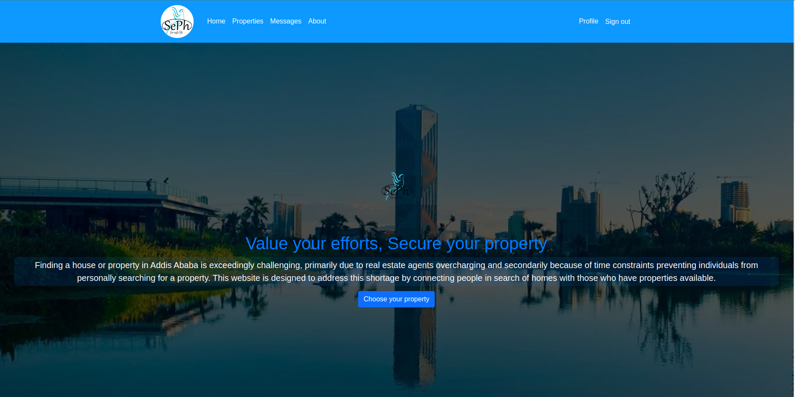

# SePh
### Value your Time, Secure your property!

## Challenge statement
Finding a house or property in Addis Ababa is very difficult, mainly because real estate(house) agents charge more than necessary and secondly because there is no time to go and look for a house for ownself.

This platform has been designed and developed to address this shortage. And this platform simply connects people finding for a rental property with those who has a property. Once a property owner posts a property using (add a property button in the profile view) the property automatically listed in the property list. Then the house seekers choose the right one from the listed houses and make an agreement with the person who posted it through a chat room to rent the house they want.

## Run the app
to run the app use ./run(For linux based distributions)
### Check it out on https://seph.hightier.tech/

## Admin area
administrators can add a city, subcity and category of the property using the django builtin admin site
url/admin

## Database
For the ease of use SQLLite3 database is used in this project and can be changed from "seph_v2/settings.py" according to your needs.
Django model is used as a ORM

### This project has 10 db tables
1. user: is used to hold all datas of a user up on registration. most of the other tables are associated to a single user.
2. city, subcity, and category: are independent tables that can only be accessed by admins
3. chatroom, and messages : are used to make communications possible within the app
    chatroom is used for mapping conversations of two users in one while message is a child table of the room(Messages between two users has only one chatroom parent)
4. property holds a property details of a user's property: since a user can have multiple property their relation is one to many.
5. propertyimage: datas of images associated to a property is held in this table. it has one to many relation with a property(since single property can have upto three images)
6. roomusers: is optional db table used to hold roomusers of a single user. (This is not implemented in this project)

## The app
The project has 3 main apps:
User: for additional user information
Property: an app dedicated to handle property
Chat: used to handle messages

## Recommendations
The frontend of the app is not fully implemented yet, and jquery  is planned to be used. API will be developed soon. 

## Licence
Copyright Protected

## Authors
1. Yoseph Tamirat

## Advisors
1. Inclusive Technologies
* Esayas Yohannes
* Mahilet Seifu
* Nagasa Fufa